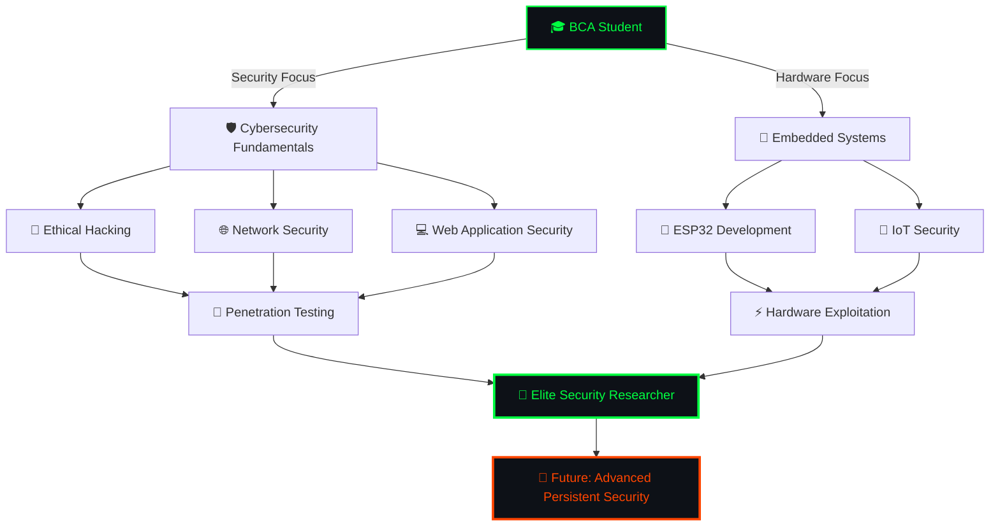

<div align="center">

```ascii
███╗   ███╗██╗   ██╗███████╗██╗  ██╗ █████╗ ██████╗ 
████╗ ████║██║   ██║██╔════╝██║  ██║██╔══██╗██╔══██╗
██╔████╔██║██║   ██║███████╗███████║███████║██████╔╝
██║╚██╔╝██║██║   ██║╚════██║██╔══██║██╔══██║██╔══██╗
██║ ╚═╝ ██║╚██████╔╝███████║██║  ██║██║  ██║██████╔╝
╚═╝     ╚═╝ ╚═════╝ ╚══════╝╚═╝  ╚═╝╚═╝  ╚═╝╚═════╝ 
```


```console
root@mushab:~# whoami
Muhammad Mushab Moidu - Offensive Security Specialist
root@mushab:~# cat /etc/shadow | grep passion
cybersecurity:penetration_testing:hardware_hacking:IoT_security
```

[](mailto:mushabmuchu2033@gmail.com)
[](https://www.linkedin.com/in/muhammad-mushab-moidu-971266375)
[](https://github.com/Muhammednihalmp)

</div>

---

## 🎯 `$ cat system_profile.sh`

```bash
#!/bin/bash
# ════════════════════════════════════════════════════════════
# PROFILE: Offensive Security Researcher
# ════════════════════════════════════════════════════════════

export FULLNAME="Muhammad Mushab Moidu"
export ROLE="Penetration Tester | Hardware Hacker"
export CLEARANCE_LEVEL="Ethical Hacker"
export LOCATION="Kerala, India 🇮🇳"
export EDUCATION="BCA @ Yenepoya University"

# ════════ Current Operations ════════
ACTIVE_MISSIONS=(
    "ESP32 Penetration Testing Arsenal Development"
    "Telegram Bot IoT Command & Control Systems"
    "RF/Wi-Fi/BLE Exploitation Framework"
    "Hardware Reverse Engineering Laboratory"
    "Cryptographic Protocol Analysis"
)

# ════════ Engagement Rules ════════
echo "[*] Rules of Engagement:"
echo "    1. Authorized Testing Only"
echo "    2. Responsible Disclosure"
echo "    3. Knowledge Sharing"
echo "    4. Continuous Learning"
echo ""
echo "[✓] System Motto: 'Break to Build, Hack to Protect'"
```


## 🚨 `$ ./active_operations.sh --list`

<table>
<tr>
<td width="50%" valign="top">

### 🔴 `[OPERATION: NIGHTHAWK]`
**ESP32 Advanced Penetration Suite**

```c
// Mission Brief: Hardware-based security toolkit
Status: [████████░░] 80% Complete
Classification: Active Development

Capabilities:
├─ Wi-Fi Deauthentication & Evil Twin
├─ Bluetooth LE Sniffing & Injection
├─ RF Signal Analysis (433MHz/315MHz)
├─ Packet Injection & Manipulation
└─ Remote Command & Control via 4G/5G
```

**Arsenal:** `ESP32` `C++` `Arduino` `SDR` `RF Tools`

</td>
<td width="50%" valign="top">

### 🔴 `[OPERATION: PHANTOM]`
**Telegram IoT C2 Framework**

```python
# Mission Brief: Covert IoT control infrastructure
Status: [██████████] 100% Operational
Classification: Production Ready

Features:
├─ Encrypted Command Channels
├─ Multi-Device Orchestration
├─ Real-time Telemetry & Exfiltration
├─ Automated Penetration Workflows
└─ Secure Payload Deployment
```

**Arsenal:** `Python` `Telegram API` `asyncio` `cryptography`

</td>
</tr>
</table>


## 🛠️ `$ cat /root/.arsenal/weapons_cache.log`

### `> Programming & Scripting Languages`
```plaintext
┌─[root@kali]─[~/.arsenal/languages]
└──╼ $ ls -la
```
<p align="center">
  
</p>

### `> Offensive Security Toolkit`

<details>
<summary><b>🔓 [CLICK TO DECRYPT WEAPONS MANIFEST]</b></summary>

```plaintext
╔═══════════════════════════════════════════════════════════════╗
║                    OFFENSIVE ARSENAL v3.7                     ║
║                   [CLASSIFIED - EYES ONLY]                    ║
╚═══════════════════════════════════════════════════════════════╝

┌───────────────────────────────────────────────────────────────┐
│ RECONNAISSANCE & ENUMERATION                                  │
├───────────────────────────────────────────────────────────────┤
│ • Nmap          → Network mapping & port scanning             │
│ • Netdiscover   → ARP reconnaissance                          │
│ • theHarvester  → OSINT & email harvesting                    │
│ • Maltego       → Link analysis & data mining                 │
│ • Shodan        → IoT device discovery                        │
│ • Recon-ng      → Web reconnaissance framework                │
└───────────────────────────────────────────────────────────────┘

┌───────────────────────────────────────────────────────────────┐
│ VULNERABILITY ANALYSIS                                        │
├───────────────────────────────────────────────────────────────┤
│ • Nessus        → Vulnerability scanner                       │
│ • OpenVAS       → Security scanner                            │
│ • Nikto         → Web server scanner                          │
│ • WPScan        → WordPress security scanner                  │
│ • Nuclei        → Template-based scanner                      │
└───────────────────────────────────────────────────────────────┘

┌───────────────────────────────────────────────────────────────┐
│ WEB APPLICATION EXPLOITATION                                  │
├───────────────────────────────────────────────────────────────┤
│ • Burp Suite    → Intercepting proxy & scanner                │
│ • OWASP ZAP     → Web app security testing                    │
│ • SQLmap        → SQL injection automation                    │
│ • Gobuster      → Directory/file brute-forcing                │
│ • Dirb          → Web content scanner                         │
│ • Ffuf          → Fast web fuzzer                             │
│ • XSStrike      → XSS detection suite                         │
└───────────────────────────────────────────────────────────────┘

┌───────────────────────────────────────────────────────────────┐
│ NETWORK EXPLOITATION                                          │
├───────────────────────────────────────────────────────────────┤
│ • Metasploit    → Exploitation framework                      │
│ • Responder     → LLMNR/NBT-NS poisoner                       │
│ • Evil-WinRM    → Windows remote management                   │
│ • CrackMapExec  → Post-exploitation toolkit                   │
│ • BloodHound    → Active Directory reconnaissance             │
└───────────────────────────────────────────────────────────────┘

┌───────────────────────────────────────────────────────────────┐
│ PASSWORD ATTACKS                                              │
├───────────────────────────────────────────────────────────────┤
│ • Hashcat       → Advanced password recovery (GPU-accelerated)│
│ • John the R.   → Password cracking suite                     │
│ • Hydra         → Network login brute-forcer                  │
│ • Medusa        → Parallel brute-force tool                   │
│ • CeWL          → Custom wordlist generator                   │
└───────────────────────────────────────────────────────────────┘

┌───────────────────────────────────────────────────────────────┐
│ WIRELESS ATTACKS                                              │
├───────────────────────────────────────────────────────────────┤
│ • Aircrack-ng   → Wi-Fi security auditing suite               │
│ • Wifite        → Automated wireless attacks                  │
│ • Bettercap     → Network reconnaissance & MITM               │
│ • Ettercap      → Network sniffer/interceptor                 │
│ • Kismet        → Wireless network detector                   │
│ • Reaver        → WPS attack tool                             │
└───────────────────────────────────────────────────────────────┘

┌───────────────────────────────────────────────────────────────┐
│ SNIFFING & SPOOFING                                           │
├───────────────────────────────────────────────────────────────┤
│ • Wireshark     → Network protocol analyzer                   │
│ • Tcpdump       → Command-line packet analyzer                │
│ • Ettercap      → MITM attack framework                       │
│ • Arpspoof      → ARP cache poisoning                         │
│ • Dnsspoof      → DNS spoofing tool                           │
└───────────────────────────────────────────────────────────────┘

┌───────────────────────────────────────────────────────────────┐
│ REVERSE ENGINEERING & MALWARE ANALYSIS                        │
├───────────────────────────────────────────────────────────────┤
│ • Ghidra        → Software reverse engineering suite          │
│ • IDA Pro       → Disassembler & debugger                     │
│ • Radare2       → RE framework                                │
│ • OllyDbg       → x86 debugger                                │
│ • x64dbg        → x64/x32 debugger                            │
│ • Cutter        → Reverse engineering platform                │
└───────────────────────────────────────────────────────────────┘

┌───────────────────────────────────────────────────────────────┐
│ FORENSICS & INCIDENT RESPONSE                                 │
├───────────────────────────────────────────────────────────────┤
│ • Autopsy       → Digital forensics platform                  │
│ • Volatility    → Memory forensics framework                  │
│ • Sleuth Kit    → File system forensics                       │
│ • Binwalk       → Firmware analysis tool                      │
│ • FTK Imager    → Data preview & imaging                      │
└───────────────────────────────────────────────────────────────┘

┌───────────────────────────────────────────────────────────────┐
│ SOCIAL ENGINEERING                                            │
├───────────────────────────────────────────────────────────────┤
│ • SET           → Social Engineering Toolkit                  │
│ • Gophish       → Phishing framework                          │
│ • King Phisher  → Phishing campaign toolkit                   │
│ • BeEF          → Browser exploitation framework              │
└───────────────────────────────────────────────────────────────┘

╔═══════════════════════════════════════════════════════════════╗
║ [*] All tools are used for authorized testing only           ║
║ [*] Ethical hacking & responsible disclosure                  ║
╚═══════════════════════════════════════════════════════════════╝
```

</details>

### `> Hardware & IoT Arsenal`

```plaintext
┌─[root@hardware-lab]─[~/devices]
└──╼ $ lsusb && ls /dev/tty*
```

<p align="center">
  
  
  
  
  
  
</p>

### `> Operating Systems`

```plaintext
┌─[root@multiboot]─[/boot/grub]
└──╼ $ cat menu.lst
```

<p align="center">
  
  
  
  
  
</p>


## 📊 `$ python3 github_analytics.py --generate-report`

<div align="center">

```plaintext
[*] Initializing GitHub Intelligence Gathering...
[*] Connecting to target: github.com/Muhammednihalmp
[✓] Connection established - Analyzing repository metrics...
```


```plaintext
[✓] Analysis complete - Threat level: IMPRESSIVE
[*] Recommendation: Continue active development
```

</div>


## 🎓 `$ cat skill_tree.mermaid`



### `> Current Training Modules [ACTIVE]`

```console
root@mushab:~# tail -f /var/log/learning.log

[2025-11-06 14:23:15] [INFO] Module: Advanced Penetration Testing
[2025-11-06 14:23:16] [PROGRESS] ████████████████░░░░ 75%
[2025-11-06 14:23:17] [INFO] Module: Hardware Reverse Engineering  
[2025-11-06 14:23:18] [PROGRESS] ███████████░░░░░░░░░ 55%
[2025-11-06 14:23:19] [INFO] Module: RF/SDR Exploitation
[2025-11-06 14:23:20] [PROGRESS] ████████████░░░░░░░░ 60%
[2025-11-06 14:23:21] [INFO] Module: Cryptographic Protocol Analysis
[2025-11-06 14:23:22] [PROGRESS] ██████████░░░░░░░░░░ 50%
[2025-11-06 14:23:23] [INFO] Module: IoT Security & Firmware Analysis
[2025-11-06 14:23:24] [PROGRESS] ██████████████░░░░░░ 70%
```


## 💀 `$ cat /etc/hacker_manifesto`

<div align="center">

```plaintext
╔═══════════════════════════════════════════════════════════════╗
║                                                               ║
║              THE ETHICAL HACKER'S MANIFESTO                   ║
║                                                               ║
╚═══════════════════════════════════════════════════════════════╝

"The true hacker is not a criminal, but a guardian.
 We break systems not to destroy, but to understand.
 We find vulnerabilities not to exploit, but to protect.
 We hack not for chaos, but for knowledge and security."

┌───────────────────────────────────────────────────────────┐
│                    CORE PRINCIPLES                        │
├───────────────────────────────────────────────────────────┤
│  [✓] Knowledge is power, but responsibility is wisdom     │
│  [✓] Always operate within legal boundaries               │
│  [✓] Practice responsible disclosure                      │
│  [✓] Protect user privacy and data                        │
│  [✓] Share knowledge to strengthen the community          │
│  [✓] Continuous learning and skill refinement             │
│  [✓] Use skills to make the digital world safer           │
└───────────────────────────────────────────────────────────┘

"We don't break into systems - we understand them deeply
 enough to show how they can be made unbreakable."
```

</div>


## 🤝 `$ ./establish_connection.sh --collaboration`

<div align="center">

```plaintext
┌─[COLLABORATION PROTOCOL]─[ACTIVE]
│
├─ [*] Open for Security Research Projects
├─ [*] Hardware Hacking & IoT Security
├─ [*] CTF Team Formation
├─ [*] Open Source Security Tool Development
├─ [*] Bug Bounty Collaborations
└─ [*] Knowledge Sharing & Mentorship

    "The best hackers collaborate, not compete."
```

### 📡 Communication Channels

[](mailto:mushabmuchu2033@gmail.com)
[](https://www.linkedin.com/in/muhammad-mushab-moidu-971266375)
[](https://github.com/Muhammednihalmp)

<br>

```console
root@mushab:~# echo $CONNECTION_STATUS
[✓] All systems operational - Standing by for incoming connections
```


</div>


<div align="center">

```ascii
┌──────────────────────────────────────────────────────────────┐
│                                                              │
│  "In the realm of zeros and ones, we find truth.            │
│   In the art of exploitation, we forge protection.          │
│   In the pursuit of knowledge, we build a safer world."     │
│                                                              │
│                    - Muhammad Mushab Moidu                   │
│                                                              │
└──────────────────────────────────────────────────────────────┘

 ██████╗ ██████╗ ██████╗ ███████╗    ██████╗ ██╗   ██╗
██╔════╝██╔═══██╗██╔══██╗██╔════╝    ██╔══██╗╚██╗ ██╔╝
██║     ██║   ██║██║  ██║█████╗      ██████╔╝ ╚████╔╝ 
██║     ██║   ██║██║  ██║██╔══╝      ██╔══██╗  ╚██╔╝  
╚██████╗╚██████╔╝██████╔╝███████╗    ██████╔╝   ██║   
 ╚═════╝ ╚═════╝ ╚═════╝ ╚══════╝    ╚═════╝    ╚═╝   

        MUHAMMAD MUSHAB | @Muhammednihalmp
    Crafted with 💚 and powered by curiosity
              [System Status: ONLINE]
```

</div>

---

<div align="center">
  <sub>🔒 Remember: With great power comes great responsibility. Hack ethically. 🔒</sub>
</div>
