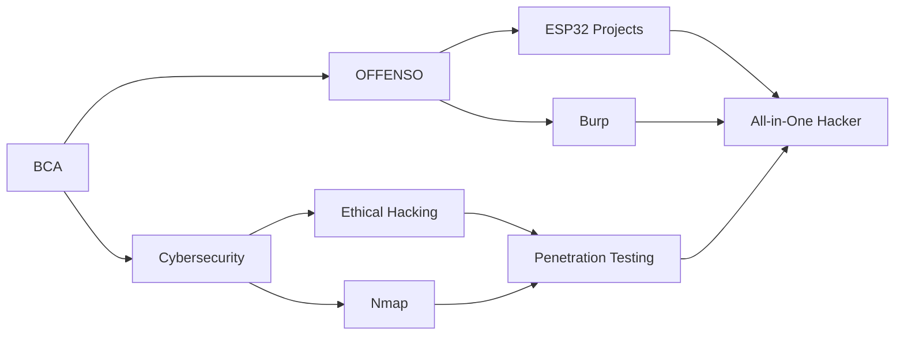

# 👋 Hi — I'm **Muhammad Mushab Moidu**  
### 🛡️ Cybersecurity Student · Penetration Tester in training · Bug hunter

---

## 🚀 About me
I’m a hands-on cybersecurity student with practical experience in penetration testing, network scanning, and vulnerability assessment. I love CTFs, building tools that automate boring tasks, and learning hardware & wireless exploitation techniques.

(Info taken from my resume.) :contentReference[oaicite:2]{index=2}

---

## 🧰 Skills & Tools

**Languages:** Python, Bash, basic C/C++ (working knowledge)  
**Pentesting / Tools:** Burp Suite, Nmap, Wireshark, Metasploit, Burp, SIEM basics  
**Networking:** TCP/IP, subnetting, Packet Tracer experience (Cisco fundamentals)  
**Interests:** Web app security, network security, IoT & hardware hacking, CTFs

---

## 🔭 Current Focus
- Hands-on practice with TryHackMe / Hack The Box labs  
- Building small tooling scripts to streamline recon and reporting  
- Learning wireless & IoT exploitation techniques  
- Improving report-writing and mitigation recommendations

---

## 🧩 Projects (examples you can add)
> Replace these with links to your repos when ready.

- **CTF-Toolkit** — small Python tools for automating recon and flag extraction  
- **Network-Scan-Reports** — templates and scripts to turn `nmap` output into human-readable reports  
- **ESP32-Pentest-Tools** — prototype scripts (learning IoT/hardware exploitation)

---

## 📝 Experience & Education
- **Cybersecurity Student Trainee** — hands-on labs: TryHackMe, HTB, practical pentests on VMs. :contentReference[oaicite:3]{index=3}  
- **Cisco / Network basics** — routing, switching, subnetting practice using Packet Tracer. :contentReference[oaicite:4]{index=4}

---

## 🎓 Certifications & Badges
- Add any certificates here (TryHackMe paths, Hack The Box ranks, Cisco course names, webinar attendance, etc.)
- Example: *Hacker First Move 2025 — Webinar participant.* :contentReference[oaicite:5]{index=5}

---

## 📊 GitHub Analytics

  
  

  

  

## 🎓 Learning Journey

### 🌱 Currently Mastering
- 🔐 Advanced Penetration Testing Techniques
- 🔧 Hardware Reverse Engineering & Exploitation
- 🤖 Robotics & Automation Systems
- 📡 Wireless Communication Protocols
- 🛡️ Network Security Architecture

## 💬 Philosophy
> "Hacking is learning — understand systems deeply to secure and improve them."

---

## 📫 Contact
- **Email:** mushabmuchu313@gmail.com  
- **LinkedIn:** https://www.linkedin.com/in/muhammad-mushab-moidu-971266375  

---

## ⚡ Inspiration
I modeled the style on a clean, hacker-styled README with badges and a typing banner for a modern portfolio look. :contentReference[oaicite:6]{index=6}

---

Made with passion, curiosity, and lots of lab time. 🔐🧪

